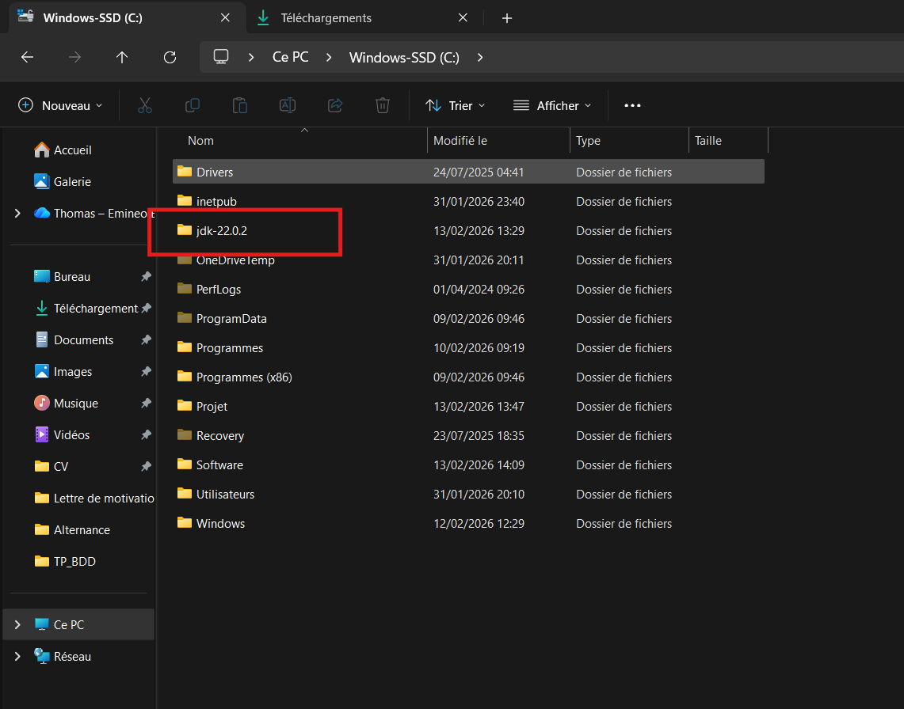
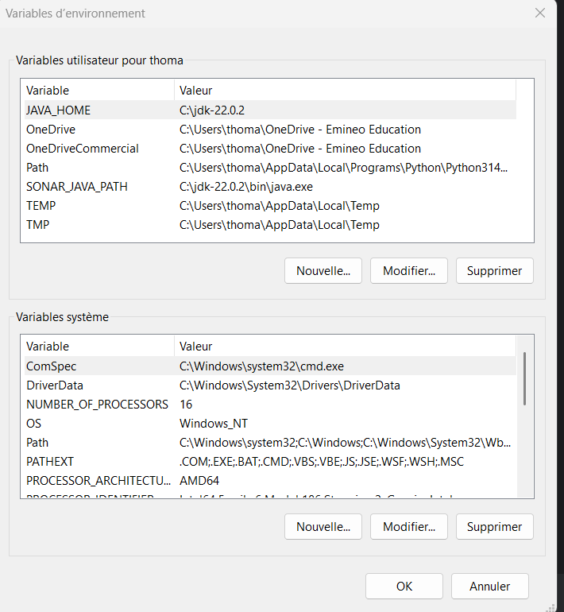
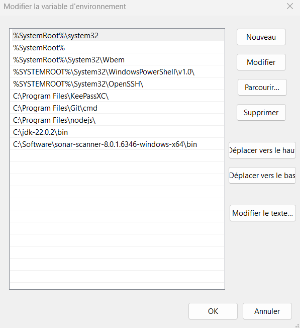
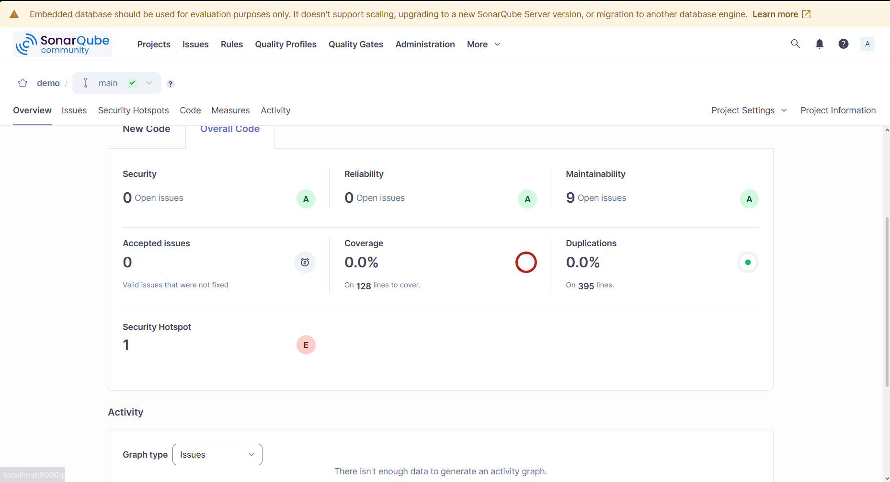

# Informations
Ce projet a été fait avec le sujet suivant : [APIArticle](https://chocolaterie.github.io/documentation/docs/nodejs/tp-bdd-abstrait/tp-nodejs-bdd-abstrait-01/).  
Je l'ai réalisé du 12/02/2026 au 13/02/2026, en cours de BDD à Sup de Vinci, sur l'IDE Webstorm.  

# Liste des tâches  

- Avoir une architecture clean : ✅
- Deux DAO interchangeables (MongoDB et MySQL) : ✅
- Interface d'abstraction IDAOArticle: ✅
- Sélectionner la DAO selon notre choix : ✅
- Création de l'API en lien avec le front [Angular](https://github.com/ThBraud/Projet-JavaScript-Angular-B2-SDV) : ✅
- **MongoDB** : 
  - Création d'un article via une méthode POST : ✅
    - Celui-ci ne marche pas avec le front, c'est un plus. 
  - Créer un save/update pour la gestion des articles : ✅
  - Récupérer un article selon son uid : ✅
  - Avoir tous les articles via une méthode GET : ✅
  - Possibilité de supprimer un article : ✅  

- MySQL : 
  - Création d'un article via une méthode POST : ✅
    - Celui-ci ne marche pas avec le front, c'est un plus.
  - Créer un save/update pour la gestion des articles : ✅
  - Récupérer un article selon son uid : ✅
  - Avoir tous les articles via une méthode GET : ✅
  - Possibilité de supprimer un article : ✅

# Comment marche le projet ? 
Pour faire fonctionner le projet il y a deux méthodes : 

## Méthode 1 : 
- Télécharger le zip de ce repo, l'ouvrir sur Webstorm ou autre IDE semblable. 
- Faire npm install dans le terminal pour avoir toutes les dépendances
- Lancer le projet 
- Utiliser Postman (ou autre plateforme pour test des API)
- Tester chaque requête

## Méthode 2 
- Télécharger le zip de ce repo, l'ouvrir sur Webstorm ou autre IDE semblable.
- Faire npm install dans le terminal pour avoir toutes les dépendances
- Télécharger le zip du projet [Angular](https://github.com/ThBraud/Projet-JavaScript-Angular-B2-SDV)
- L'ouvrir dans un IDE et faire un npm install
- Modifier le projet angular pour qu'il marche avec la BDD
- Lancer le back avec la commande npm start
- Lancer le front avec la commande ng serve
- Aller sur localhost:4200
- Tester chaque adresse

# Installation de Sonar en local  
Cela correspond à cette partie du TP : [Partie 3](https://chocolaterie.github.io/documentation/docs/nodejs/tp-bdd-abstrait/tp-nodejs-bdd-abstrait-03)
J'ai suivi ce [tutoriel](https://chocolaterie.github.io/documentation/docs/general/sonar/)
- Dossier JDK

- Variable d'environnement et variables système  

  
  

- Page du Sonar  

